Reaktor: Summer Job Application by OJ
================
Olli 'OJ' Jokinen
Feb/2019


TASKS 1,3,4,5
=============

#### The questions I'm going to answer

-   What is the long term trend of temperature like?
-   How are the long term trend of human caused gas emissions like?
-   How much Carbon Dioxide drives Global Warming?
-   Are there any interaction or correlation between these factors?
-   How do the future looks like of temperature and gas emissions?
-   What is the relationship of GDP and Total Emissions like?
-   What are is the sketch of the Interface like?
-   What the models do and don't take into account?
-   How reliable are predictions?

#### References

-   IPCC report showed that "Climate-related risks for natural and human systems are higher for global warming of 1.5 Celcius than at present, but lower than at 2 Celcius (high confidence)."
-   The global goal is to reduce emissions 45% before 2030 and carbon frootprint should be negative after 2050

###### Data sources used in the project: World Bank (R's API package), Berkeley Earth (Web) and NASA (Web).

The Storytell begins
====================


### Getting Gas Emission Data

##### Install World Bank API packages

``` r
#install.packages('WDI')
```

-   I use World Bank API to search for indicators of Top3 Emissions: Carbon, Methane and Nitous Oxide and Other Emissions

``` r
WDI::WDIsearch('co2')
```

    ##       indicator             
    ##  [1,] "EN.CO2.OTHX.ZS"      
    ##  [2,] "EN.CO2.MANF.ZS"      
    ##  [3,] "EN.CO2.ETOT.ZS"      
    ##  [4,] "EN.CO2.BLDG.ZS"      
    ##  [5,] "EN.CLC.GHGR.MT.CE"   
    ##  [6,] "EN.ATM.SF6G.KT.CE"   
    ##  [7,] "EN.ATM.PFCG.KT.CE"   
    ##  [8,] "EN.ATM.NOXE.KT.CE"   
    ##  [9,] "EN.ATM.NOXE.EG.KT.CE"
    ## [10,] "EN.ATM.NOXE.AG.KT.CE"
    ## [11,] "EN.ATM.METH.KT.CE"   
    ## [12,] "EN.ATM.METH.EG.KT.CE"
    ## [13,] "EN.ATM.METH.AG.KT.CE"
    ## [14,] "EN.ATM.HFCG.KT.CE"   
    ## [15,] "EN.ATM.GHGT.KT.CE"   
    ## [16,] "EN.ATM.GHGO.KT.CE"   
    ## [17,] "EN.ATM.CO2E.SF.ZS"   
    ## [18,] "EN.ATM.CO2E.SF.KT"   
    ## [19,] "EN.ATM.CO2E.PP.GD.KD"
    ## [20,] "EN.ATM.CO2E.PP.GD"   
    ## [21,] "EN.ATM.CO2E.PC"      
    ## [22,] "EN.ATM.CO2E.LF.ZS"   
    ## [23,] "EN.ATM.CO2E.LF.KT"   
    ## [24,] "EN.ATM.CO2E.KT"      
    ## [25,] "EN.ATM.CO2E.KD.GD"   
    ## [26,] "EN.ATM.CO2E.GL.KT"   
    ## [27,] "EN.ATM.CO2E.GF.ZS"   
    ## [28,] "EN.ATM.CO2E.GF.KT"   
    ## [29,] "EN.ATM.CO2E.FF.ZS"   
    ## [30,] "EN.CO2.TRAN.ZS"      
    ## [31,] "EN.ATM.CO2E.FF.KT"   
    ## [32,] "EN.ATM.CO2E.EG.ZS"   
    ## [33,] "EN.ATM.CO2E.CP.KT"   
    ##       name                                                                                                                               
    ##  [1,] "CO2 emissions from other sectors, excluding residential buildings and commercial and public services (% of total fuel combustion)"
    ##  [2,] "CO2 emissions from manufacturing industries and construction (% of total fuel combustion)"                                        
    ##  [3,] "CO2 emissions from electricity and heat production, total (% of total fuel combustion)"                                           
    ##  [4,] "CO2 emissions from residential buildings and commercial and public services (% of total fuel combustion)"                         
    ##  [5,] "GHG net emissions/removals by LUCF (Mt of CO2 equivalent)"                                                                        
    ##  [6,] "SF6 gas emissions (thousand metric tons of CO2 equivalent)"                                                                       
    ##  [7,] "PFC gas emissions (thousand metric tons of CO2 equivalent)"                                                                       
    ##  [8,] "Nitrous oxide emissions (thousand metric tons of CO2 equivalent)"                                                                 
    ##  [9,] "Nitrous oxide emissions in energy sector (thousand metric tons of CO2 equivalent)"                                                
    ## [10,] "Agricultural nitrous oxide emissions (thousand metric tons of CO2 equivalent)"                                                    
    ## [11,] "Methane emissions (kt of CO2 equivalent)"                                                                                         
    ## [12,] "Methane emissions in energy sector (thousand metric tons of CO2 equivalent)"                                                      
    ## [13,] "Agricultural methane emissions (thousand metric tons of CO2 equivalent)"                                                          
    ## [14,] "HFC gas emissions (thousand metric tons of CO2 equivalent)"                                                                       
    ## [15,] "Total greenhouse gas emissions (kt of CO2 equivalent)"                                                                            
    ## [16,] "Other greenhouse gas emissions, HFC, PFC and SF6 (thousand metric tons of CO2 equivalent)"                                        
    ## [17,] "CO2 emissions from solid fuel consumption (% of total)"                                                                           
    ## [18,] "CO2 emissions from solid fuel consumption (kt) "                                                                                  
    ## [19,] "CO2 emissions (kg per 2011 PPP $ of GDP)"                                                                                         
    ## [20,] "CO2 emissions (kg per PPP $ of GDP)"                                                                                              
    ## [21,] "CO2 emissions (metric tons per capita)"                                                                                           
    ## [22,] "CO2 emissions from liquid fuel consumption (% of total) "                                                                         
    ## [23,] "CO2 emissions from liquid fuel consumption (kt) "                                                                                 
    ## [24,] "CO2 emissions (kt)"                                                                                                               
    ## [25,] "CO2 emissions (kg per 2010 US$ of GDP)"                                                                                           
    ## [26,] "CO2 emissions from gas flaring (thousand metric tons)"                                                                            
    ## [27,] "CO2 emissions from gaseous fuel consumption (% of total) "                                                                        
    ## [28,] "CO2 emissions from gaseous fuel consumption (kt) "                                                                                
    ## [29,] "CO2 emissions from fossil-fuels (% of total)"                                                                                     
    ## [30,] "CO2 emissions from transport (% of total fuel combustion)"                                                                        
    ## [31,] "CO2 emissions from fossil-fuels, total (thousand metric tons)"                                                                    
    ## [32,] "CO2 intensity (kg per kg of oil equivalent energy use)"                                                                           
    ## [33,] "CO2 emissions from cement production (thousand metric tons)"

``` r
#Methane, CH4: 
# [11,] "Methane emissions (kt of CO2 equivalent)"   
# INDICATOR: "EN.ATM.METH.KT.CE"   

#Carbon, CO2 
# [24,] "CO2 emissions (kt)"   
#INDICATOR: "EN.ATM.CO2E.KT"   

#Nitrous oxide, N2O
WDI::WDIsearch('nitrous')
```

    ##      indicator             
    ## [1,] "EN.ATM.NOXE.ZG"      
    ## [2,] "EN.ATM.NOXE.KT.CE"   
    ## [3,] "EN.ATM.NOXE.IN.ZS"   
    ## [4,] "EN.ATM.NOXE.EG.ZS"   
    ## [5,] "EN.ATM.NOXE.EG.KT.CE"
    ## [6,] "EN.ATM.NOXE.AG.ZS"   
    ## [7,] "EN.ATM.NOXE.AG.KT.CE"
    ##      name                                                                                             
    ## [1,] "Nitrous oxide emissions (% change from 1990)"                                                   
    ## [2,] "Nitrous oxide emissions (thousand metric tons of CO2 equivalent)"                               
    ## [3,] "Nitrous oxide emissions in industrial and energy processes (% of total nitrous oxide emissions)"
    ## [4,] "Nitrous oxide emissions in energy sector (% of total)"                                          
    ## [5,] "Nitrous oxide emissions in energy sector (thousand metric tons of CO2 equivalent)"              
    ## [6,] "Agricultural nitrous oxide emissions (% of total)"                                              
    ## [7,] "Agricultural nitrous oxide emissions (thousand metric tons of CO2 equivalent)"

``` r
#[2,] "Nitrous oxide emissions (thousand metric tons of CO2 equivalent)"        
#INDICATOR: "EN.ATM.NOXE.KT.CE"   

WDI::WDI(country="WLD",indicator = "EN.ATM.CO2E.KT")
```

    ##   iso2c country EN.ATM.CO2E.KT year
    ## 1    1W   World       34847501 2011
    ## 2    1W   World       33472376 2010
    ## 3    1W   World       31891899 2009
    ## 4    1W   World       32181592 2008
    ## 5    1W   World       31180501 2007
    ## 6    1W   World       30568112 2006
    ## 7    1W   World       29490014 2005

``` r
# -> only data from 2005-2011, I will use another API of WB, wbstats

WDI::WDIsearch('emissions')
```

    ##       indicator             
    ##  [1,] "EN.CO2.OTHX.ZS"      
    ##  [2,] "EN.CO2.MANF.ZS"      
    ##  [3,] "EN.CO2.ETOT.ZS"      
    ##  [4,] "EN.CO2.BLDG.ZS"      
    ##  [5,] "EN.CLC.GHGR.MT.CE"   
    ##  [6,] "EN.ATM.SF6G.KT.CE"   
    ##  [7,] "EN.ATM.PFCG.KT.CE"   
    ##  [8,] "EN.ATM.NOXE.ZG"      
    ##  [9,] "EN.ATM.NOXE.KT.CE"   
    ## [10,] "EN.ATM.NOXE.IN.ZS"   
    ## [11,] "EN.ATM.NOXE.EG.ZS"   
    ## [12,] "EN.ATM.NOXE.EG.KT.CE"
    ## [13,] "EN.ATM.NOXE.AG.ZS"   
    ## [14,] "EN.ATM.NOXE.AG.KT.CE"
    ## [15,] "EN.ATM.METH.ZG"      
    ## [16,] "EN.ATM.METH.KT.CE"   
    ## [17,] "EN.ATM.METH.IN.ZS"   
    ## [18,] "EN.ATM.METH.EG.ZS"   
    ## [19,] "EN.ATM.METH.EG.KT.CE"
    ## [20,] "EN.ATM.METH.AG.ZS"   
    ## [21,] "EN.ATM.METH.AG.KT.CE"
    ## [22,] "EN.ATM.HFCG.KT.CE"   
    ## [23,] "EN.ATM.GHGT.ZG"      
    ## [24,] "EN.ATM.GHGT.KT.CE"   
    ## [25,] "EN.ATM.GHGO.ZG"      
    ## [26,] "EN.ATM.GHGO.KT.CE"   
    ## [27,] "EN.ATM.CO2E.SF.ZS"   
    ## [28,] "EN.ATM.CO2E.SF.KT"   
    ## [29,] "EN.ATM.CO2E.PP.GD.KD"
    ## [30,] "EN.ATM.CO2E.PP.GD"   
    ## [31,] "EN.ATM.CO2E.PC"      
    ## [32,] "EN.ATM.CO2E.LF.ZS"   
    ## [33,] "EN.ATM.CO2E.LF.KT"   
    ## [34,] "EN.ATM.CO2E.KT"      
    ## [35,] "EN.ATM.CO2E.KD.GD"   
    ## [36,] "EN.ATM.CO2E.GL.KT"   
    ## [37,] "EN.ATM.CO2E.GF.ZS"   
    ## [38,] "EN.ATM.CO2E.GF.KT"   
    ## [39,] "EN.ATM.CO2E.FF.ZS"   
    ## [40,] "EN.CO2.TRAN.ZS"      
    ## [41,] "EN.ATM.CO2E.FF.KT"   
    ## [42,] "EN.ATM.CO2E.CP.KT"   
    ## [43,] "EE.BOD.TOTL.KG"      
    ##       name                                                                                                                               
    ##  [1,] "CO2 emissions from other sectors, excluding residential buildings and commercial and public services (% of total fuel combustion)"
    ##  [2,] "CO2 emissions from manufacturing industries and construction (% of total fuel combustion)"                                        
    ##  [3,] "CO2 emissions from electricity and heat production, total (% of total fuel combustion)"                                           
    ##  [4,] "CO2 emissions from residential buildings and commercial and public services (% of total fuel combustion)"                         
    ##  [5,] "GHG net emissions/removals by LUCF (Mt of CO2 equivalent)"                                                                        
    ##  [6,] "SF6 gas emissions (thousand metric tons of CO2 equivalent)"                                                                       
    ##  [7,] "PFC gas emissions (thousand metric tons of CO2 equivalent)"                                                                       
    ##  [8,] "Nitrous oxide emissions (% change from 1990)"                                                                                     
    ##  [9,] "Nitrous oxide emissions (thousand metric tons of CO2 equivalent)"                                                                 
    ## [10,] "Nitrous oxide emissions in industrial and energy processes (% of total nitrous oxide emissions)"                                  
    ## [11,] "Nitrous oxide emissions in energy sector (% of total)"                                                                            
    ## [12,] "Nitrous oxide emissions in energy sector (thousand metric tons of CO2 equivalent)"                                                
    ## [13,] "Agricultural nitrous oxide emissions (% of total)"                                                                                
    ## [14,] "Agricultural nitrous oxide emissions (thousand metric tons of CO2 equivalent)"                                                    
    ## [15,] "Methane emissions (% change from 1990)"                                                                                           
    ## [16,] "Methane emissions (kt of CO2 equivalent)"                                                                                         
    ## [17,] "Energy related methane emissions (% of total)"                                                                                    
    ## [18,] "Energy related methane emissions (% of total)"                                                                                    
    ## [19,] "Methane emissions in energy sector (thousand metric tons of CO2 equivalent)"                                                      
    ## [20,] "Agricultural methane emissions (% of total)"                                                                                      
    ## [21,] "Agricultural methane emissions (thousand metric tons of CO2 equivalent)"                                                          
    ## [22,] "HFC gas emissions (thousand metric tons of CO2 equivalent)"                                                                       
    ## [23,] "Total greenhouse gas emissions (% change from 1990)"                                                                              
    ## [24,] "Total greenhouse gas emissions (kt of CO2 equivalent)"                                                                            
    ## [25,] "Other greenhouse gas emissions (% change from 1990)"                                                                              
    ## [26,] "Other greenhouse gas emissions, HFC, PFC and SF6 (thousand metric tons of CO2 equivalent)"                                        
    ## [27,] "CO2 emissions from solid fuel consumption (% of total)"                                                                           
    ## [28,] "CO2 emissions from solid fuel consumption (kt) "                                                                                  
    ## [29,] "CO2 emissions (kg per 2011 PPP $ of GDP)"                                                                                         
    ## [30,] "CO2 emissions (kg per PPP $ of GDP)"                                                                                              
    ## [31,] "CO2 emissions (metric tons per capita)"                                                                                           
    ## [32,] "CO2 emissions from liquid fuel consumption (% of total) "                                                                         
    ## [33,] "CO2 emissions from liquid fuel consumption (kt) "                                                                                 
    ## [34,] "CO2 emissions (kt)"                                                                                                               
    ## [35,] "CO2 emissions (kg per 2010 US$ of GDP)"                                                                                           
    ## [36,] "CO2 emissions from gas flaring (thousand metric tons)"                                                                            
    ## [37,] "CO2 emissions from gaseous fuel consumption (% of total) "                                                                        
    ## [38,] "CO2 emissions from gaseous fuel consumption (kt) "                                                                                
    ## [39,] "CO2 emissions from fossil-fuels (% of total)"                                                                                     
    ## [40,] "CO2 emissions from transport (% of total fuel combustion)"                                                                        
    ## [41,] "CO2 emissions from fossil-fuels, total (thousand metric tons)"                                                                    
    ## [42,] "CO2 emissions from cement production (thousand metric tons)"                                                                      
    ## [43,] "Organic water pollutant (BOD) emissions (kg per day)"

``` r
#[24,] "Total greenhouse gas emissions (kt of CO2 equivalent)"                                                                            
#INDICATOR: [24,] "EN.ATM.GHGT.KT.CE"  
```

-   WDI emission data contains just few 7 rows of data.
-   I'll try "wbstats" - another World Bank API package.

``` r
library(wbstats)
```

-   I will download emission data from wbstats. I won't remove any missing values at this point.

``` r
co2 <- wb(country= "WLD", indicator = "EN.ATM.CO2E.KT", removeNA = F) #co2
meth <- wb(country = "WLD", indicator = "EN.ATM.METH.KT.CE", removeNA = F) #ch4
nitoxi <- wb(country = "WLD", indicator = "EN.ATM.NOXE.KT.CE", removeNA = F) #n2o
total <- wb(country= "WLD", indicator = "EN.ATM.GHGT.KT.CE", removeNA = F)
pop <- wb(country= "WLD", indicator = "SP.POP.TOTL", removeNA = F) #population
gdp <- wb(country= "WLD", indicator = "NY.GDP.MKTP.CD", removeNA = F) #gdp

dim(co2)
```

    ## [1] 59  7

##### Quick OverView on Emission data.

``` r
head(co2)
```

    ##   iso3c date    value    indicatorID          indicator iso2c country
    ## 1   WLD 2018       NA EN.ATM.CO2E.KT CO2 emissions (kt)    1W   World
    ## 2   WLD 2017       NA EN.ATM.CO2E.KT CO2 emissions (kt)    1W   World
    ## 3   WLD 2016       NA EN.ATM.CO2E.KT CO2 emissions (kt)    1W   World
    ## 4   WLD 2015       NA EN.ATM.CO2E.KT CO2 emissions (kt)    1W   World
    ## 5   WLD 2014 36138285 EN.ATM.CO2E.KT CO2 emissions (kt)    1W   World
    ## 6   WLD 2013 35837591 EN.ATM.CO2E.KT CO2 emissions (kt)    1W   World

``` r
head(meth)
```

    ##   iso3c date value       indicatorID
    ## 1   WLD 2018    NA EN.ATM.METH.KT.CE
    ## 2   WLD 2017    NA EN.ATM.METH.KT.CE
    ## 3   WLD 2016    NA EN.ATM.METH.KT.CE
    ## 4   WLD 2015    NA EN.ATM.METH.KT.CE
    ## 5   WLD 2014    NA EN.ATM.METH.KT.CE
    ## 6   WLD 2013    NA EN.ATM.METH.KT.CE
    ##                                  indicator iso2c country
    ## 1 Methane emissions (kt of CO2 equivalent)    1W   World
    ## 2 Methane emissions (kt of CO2 equivalent)    1W   World
    ## 3 Methane emissions (kt of CO2 equivalent)    1W   World
    ## 4 Methane emissions (kt of CO2 equivalent)    1W   World
    ## 5 Methane emissions (kt of CO2 equivalent)    1W   World
    ## 6 Methane emissions (kt of CO2 equivalent)    1W   World

``` r
head(nitoxi)
```

    ##   iso3c date value       indicatorID
    ## 1   WLD 2018    NA EN.ATM.NOXE.KT.CE
    ## 2   WLD 2017    NA EN.ATM.NOXE.KT.CE
    ## 3   WLD 2016    NA EN.ATM.NOXE.KT.CE
    ## 4   WLD 2015    NA EN.ATM.NOXE.KT.CE
    ## 5   WLD 2014    NA EN.ATM.NOXE.KT.CE
    ## 6   WLD 2013    NA EN.ATM.NOXE.KT.CE
    ##                                                          indicator iso2c
    ## 1 Nitrous oxide emissions (thousand metric tons of CO2 equivalent)    1W
    ## 2 Nitrous oxide emissions (thousand metric tons of CO2 equivalent)    1W
    ## 3 Nitrous oxide emissions (thousand metric tons of CO2 equivalent)    1W
    ## 4 Nitrous oxide emissions (thousand metric tons of CO2 equivalent)    1W
    ## 5 Nitrous oxide emissions (thousand metric tons of CO2 equivalent)    1W
    ## 6 Nitrous oxide emissions (thousand metric tons of CO2 equivalent)    1W
    ##   country
    ## 1   World
    ## 2   World
    ## 3   World
    ## 4   World
    ## 5   World
    ## 6   World

``` r
head(total)
```

    ##   iso3c date value       indicatorID
    ## 1   WLD 2018    NA EN.ATM.GHGT.KT.CE
    ## 2   WLD 2017    NA EN.ATM.GHGT.KT.CE
    ## 3   WLD 2016    NA EN.ATM.GHGT.KT.CE
    ## 4   WLD 2015    NA EN.ATM.GHGT.KT.CE
    ## 5   WLD 2014    NA EN.ATM.GHGT.KT.CE
    ## 6   WLD 2013    NA EN.ATM.GHGT.KT.CE
    ##                                               indicator iso2c country
    ## 1 Total greenhouse gas emissions (kt of CO2 equivalent)    1W   World
    ## 2 Total greenhouse gas emissions (kt of CO2 equivalent)    1W   World
    ## 3 Total greenhouse gas emissions (kt of CO2 equivalent)    1W   World
    ## 4 Total greenhouse gas emissions (kt of CO2 equivalent)    1W   World
    ## 5 Total greenhouse gas emissions (kt of CO2 equivalent)    1W   World
    ## 6 Total greenhouse gas emissions (kt of CO2 equivalent)    1W   World

-   Time-Series data is from either 1960 or 1970 to present. That's fine.
-   There are few extra columns. "Date" and "Value" are the most important.

##### Deleting extra columns and leave "Date" and "Value"

``` r
co2 <- co2[-c(1,4:7)]
meth <- meth[-c(1,4:7)]
nitoxi <- nitoxi[-c(1,4:7)]
total <- total[-c(1,4:7)]
gdp <- gdp[-c(1,4:7)]
pop <- pop[-c(1,4:7)]


head(co2)
```

    ##   date    value
    ## 1 2018       NA
    ## 2 2017       NA
    ## 3 2016       NA
    ## 4 2015       NA
    ## 5 2014 36138285
    ## 6 2013 35837591

-   All good.

##### Rename the columns

``` r
colnames(co2) <- c("Year","Co2")
colnames(meth) <- c("Year","CH4") 
colnames(nitoxi) <- c("Year","N2O")
colnames(total) <- c("Year","Total")
colnames(gdp) <- c("Year","Value")
colnames(pop) <- c("Year","Value")
head(co2)
```

    ##   Year      Co2
    ## 1 2018       NA
    ## 2 2017       NA
    ## 3 2016       NA
    ## 4 2015       NA
    ## 5 2014 36138285
    ## 6 2013 35837591

-   All good.

##### Create a data frame based on emission data.

``` r
last <- co2$Year[1] #present year
first <- co2$Year[nrow(co2)] #Year 1960
```

-   "last" and "first" indexes to build an automated data pipeline.

##### Create a data frame

``` r
gasemi <- data.frame( #gasemi = gas and emissions
  Year = last:first,
  co2 = co2$Co2,
  meth = meth$CH4,
  nitoxi = nitoxi$N2O,
  Total = total$Total
)

head(gasemi)
```

    ##   Year      co2 meth nitoxi Total
    ## 1 2018       NA   NA     NA    NA
    ## 2 2017       NA   NA     NA    NA
    ## 3 2016       NA   NA     NA    NA
    ## 4 2015       NA   NA     NA    NA
    ## 5 2014 36138285   NA     NA    NA
    ## 6 2013 35837591   NA     NA    NA

-   All good.

##### Add one more column: "other" = Total - co2 - ch4 - n2o

``` r
gasemi$other <- gasemi$Total-gasemi$nitoxi-gasemi$meth - gasemi$co2
gasemi$other
```

    ##  [1]       NA       NA       NA       NA       NA       NA  6887603
    ##  [8]  6892414  6538048  5415125  5807690  7839393  7353750  7484321
    ## [15]  7269714  7706075  7783504  5711975  6472366  7374095 10131992
    ## [22]  8952259  6123380  6467355  6685657  6567057  7718356  6570468
    ## [29]  6461380  4809326  4831611  5753653  4787760  4626542  4996601
    ## [36]  6449226  6714674  5183909  5411664  5398336  5274282  4952755
    ## [43]  4513429  4281562  3963720  4573269  4585568  3705397  5339670
    ## [50]       NA       NA       NA       NA       NA       NA       NA
    ## [57]       NA       NA       NA

``` r
colnames(gasemi)
```

    ## [1] "Year"   "co2"    "meth"   "nitoxi" "Total"  "other"

### Year 2010

-   Based on IPCC report: 2010 emission level is the reference level for the future actions.

``` r
gasses2010 <- gasemi[gasemi$Year==2010,]
gasses2010
```

    ##   Year      co2    meth  nitoxi    Total   other
    ## 9 2010 33472376 7815790 3084900 50911114 6538048

##### Deleting "Year" and "Total" columns

``` r
gasses2010 <- gasses2010[-c(1,5)]
```

2010 emission shares
====================

##### Building a pie chart to get a clue of 2010 shares of emissions.

``` r
library(ggplot2)
```

    ## Warning: package 'ggplot2' was built under R version 3.4.4

``` r
# Pie Chart of Emissions
slices <- gasses2010
lbls <- c("CO2", "CH4", "N2O", "Other")
pct <- round(slices/sum(slices)*100)
lbls <- paste(lbls,pct) #add percents to labels
lbls <- paste(lbls, "%",sep="") #add % to labels
pie(as.integer(slices), lbls, col= c("lightblue","pink","lightgreen","grey"),main="Pie Chart of Emissions(%), Year 2010")
```

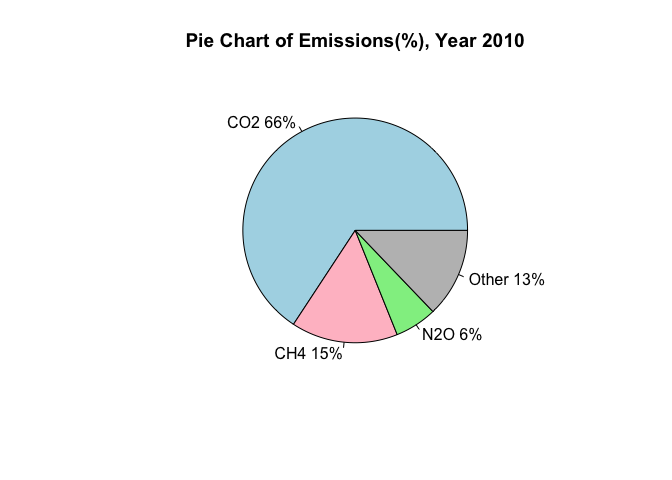

-   Carbon Dioxide emissions forms the greatest (66%) part of emissions in 2010.

##### Long Term Trend: Co2

``` r
gasplot <- ggplot(gasemi, aes(x = gasemi$Year, y = gasemi$co2),color="Carbon Dioxide") + geom_point(color="darkgreen") + geom_smooth(color="lightgreen", method=loess) + xlim(1960,2020) +  ylim(0, 4e+7) + xlab("Year") + ylab("Gas emissions (kt)")
gasplot
```

    ## Warning: Removed 4 rows containing non-finite values (stat_smooth).

    ## Warning: Removed 4 rows containing missing values (geom_point).

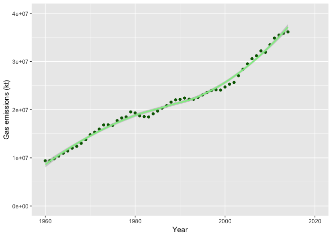 - There certainly is an upward trend in co2 emissions.

##### Long Term Trend: Co2 + CH4 + N20 + Other

``` r
gasplot2 <- gasplot + geom_point(data=gasemi, aes(x=gasemi$Year, y = gasemi$meth), color="darkblue") + geom_smooth(data = gasemi, aes(x=gasemi$Year, y = gasemi$meth) ,method=loess, color="lightblue") + geom_point(data=gasemi, aes(x=gasemi$Year, y=gasemi$nitoxi), color="orange") + geom_smooth(data=gasemi, aes(x=gasemi$Year, y = gasemi$nitoxi), method=loess, color="yellow") + geom_point(data=gasemi, aes(x=gasemi$Year, y=gasemi$other), color="purple") + geom_smooth(data=gasemi, aes(x=gasemi$Year, y = gasemi$other), method=loess, color="purple", size=0.1)
gasplot2
```

    ## Warning: Removed 4 rows containing non-finite values (stat_smooth).

    ## Warning: Removed 16 rows containing non-finite values (stat_smooth).

    ## Warning: Removed 16 rows containing non-finite values (stat_smooth).

    ## Warning: Removed 16 rows containing non-finite values (stat_smooth).

    ## Warning: Removed 4 rows containing missing values (geom_point).

    ## Warning: Removed 16 rows containing missing values (geom_point).

    ## Warning: Removed 16 rows containing missing values (geom_point).

    ## Warning: Removed 16 rows containing missing values (geom_point).

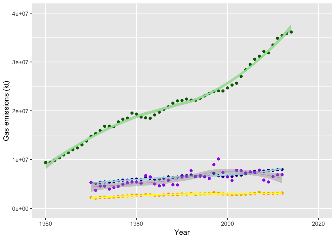

-   The growth of Carbon Dioxide emissions is the steepest
-   The amount of CO2 emissions are the highest.

Getting More Co2 Data
=====================

##### Let's see how total amount of Carbon Dioxide in atmosphere has changed in 50 years. Data source: Nasa

``` r
co2Nasa <- read.table("ftp://aftp.cmdl.noaa.gov/products/trends/co2/co2_mm_mlo.txt", comment.char = "#")
head(co2Nasa)
```

    ##     V1 V2       V3     V4     V5     V6 V7
    ## 1 1958  3 1958.208 315.71 315.71 314.62 -1
    ## 2 1958  4 1958.292 317.45 317.45 315.29 -1
    ## 3 1958  5 1958.375 317.50 317.50 314.71 -1
    ## 4 1958  6 1958.458 -99.99 317.10 314.85 -1
    ## 5 1958  7 1958.542 315.86 315.86 314.98 -1
    ## 6 1958  8 1958.625 314.93 314.93 315.94 -1

-   I need only columns V1 and V4 - "Year" and "Average Value". I delete other columns to make a data frame cleaner.
-   Co2 is expressed as a mole fraction in dry air, micromol/mol (parts per million - ppm): Total Amount of Co2 in the atmosphere.

``` r
co2Nasa <- co2Nasa[-c(2,3,5,6,7)] #delete  extra columns
colnames(co2Nasa) <- c("Year","ppm")
head(co2Nasa)
```

    ##   Year    ppm
    ## 1 1958 315.71
    ## 2 1958 317.45
    ## 3 1958 317.50
    ## 4 1958 -99.99
    ## 5 1958 315.86
    ## 6 1958 314.93

-   99.99 = data is missing.

##### Next I choose to delete missing values instead of doing any interpolations since data seems to grow steadily.

``` r
missing <- c(co2Nasa$ppm == -99.99) #missing indexes
co2Nasa <- co2Nasa[!missing,] #include only non-missing values
head(co2Nasa)
```

    ##   Year    ppm
    ## 1 1958 315.71
    ## 2 1958 317.45
    ## 3 1958 317.50
    ## 5 1958 315.86
    ## 6 1958 314.93
    ## 7 1958 313.20

-   Missing values deleted.

##### Long Term Trend: CO2 (ppm) + CO2(kt)

``` r
co2Nasa$Year <- as.integer(co2Nasa$Year)
co2Nasa$ppm <- as.double(co2Nasa$ppm)

gasplotNasa <- ggplot(co2Nasa, aes(x=Year, y=ppm)) + geom_point(color="darkgreen")

par(mfrow=c(2,1))

gasplotNasa   
```

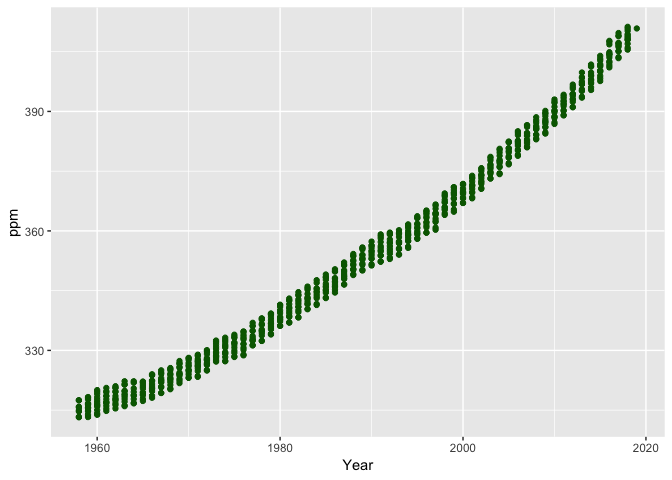

``` r
gasplot
```

    ## Warning: Removed 4 rows containing non-finite values (stat_smooth).

    ## Warning: Removed 4 rows containing missing values (geom_point).

 - The both plots(ppm, kt) have an upward trend. - The total amount of co2 and emissions caused by human have been increasing.

##### Percentual changes between 1960 and 2010 in Co2 data

``` r
ppm1 <- mean(co2Nasa$ppm[co2Nasa$Year==1960])
ppm2 <- mean(mean(co2Nasa$ppm[co2Nasa$Year==2010]))

ppm2/ppm1
```

    ## [1] 1.230325

``` r
co21960 <- gasemi$co2[gasemi$Year==1960] #co2 at 1960
co22010 <- gasemi$co2[gasemi$Year==2010] #co2 at 2010

co22010/co21960
```

    ## [1] 3.562139

-   Total amount of Carbon emissions (by human) has increased +3.5 times
-   Total amount of CO2 has increased 23%

Temperature Data
================

-   Trustworthy temperature data sets from Berkeley Earth.

##### Berkeley Earth provides global Average, Minimum and Maximum temperatures.

``` r
#TAVG summary, TMAX summary, TMIN summary, BerkeleyEarth, Land-Surface Temperature
TAVGSum <- read.table("http://berkeleyearth.lbl.gov/auto/Global/Complete_TAVG_summary.txt", comment.char = "%")
TMINSum <- read.table("http://berkeleyearth.lbl.gov/auto/Global/Complete_TMIN_summary.txt", comment.char = "%")
TMAXSum <- read.table("http://berkeleyearth.lbl.gov/auto/Global/Complete_TMAX_summary.txt",comment.char = "%")

#delete unnecesssary columns
TAVGSum <- TAVGSum[-c(4,5)] 
TMINSum <- TMINSum[-c(4,5)]
TMAXSum <- TMAXSum[-c(4,5)]


#Change column names
colnames(TAVGSum) <- c("Year","Mean","Unc") #Unc=Uncertainty
colnames(TMINSum) <- c("Year","Mean","Unc")
colnames(TMAXSum) <- c("Year","Mean","Unc")
```

##### Long Term Trend: Temperatures(Avg, Min, Max)

``` r
#Temperature Plot Summary
tempPlotSum <- ggplot(data=TAVGSum, aes(x=TAVGSum$Year, y=TAVGSum$Mean), title="Temperature")+ geom_smooth(color="lightgreen") + xlim(1850, 2020) + ylim(-1.0, 2.0)
tempPlotSum2 <-tempPlotSum + geom_smooth(data=TMINSum, aes(x=TMINSum$Year, y=TMINSum$Mean), color="pink") + geom_smooth(data=TMINSum, aes(x=TMAXSum$Year, y=TMAXSum$Mean), color="lightblue") + xlab("Year") + ylab("Mean Temperature, reference level: 1951-1980 avg temp")

tempPlotSum2
```

    ## `geom_smooth()` using method = 'loess' and formula 'y ~ x'

    ## Warning: Removed 101 rows containing non-finite values (stat_smooth).

    ## `geom_smooth()` using method = 'loess' and formula 'y ~ x'

    ## Warning: Removed 9 rows containing non-finite values (stat_smooth).

    ## `geom_smooth()` using method = 'loess' and formula 'y ~ x'

    ## Warning: Removed 2 rows containing non-finite values (stat_smooth).

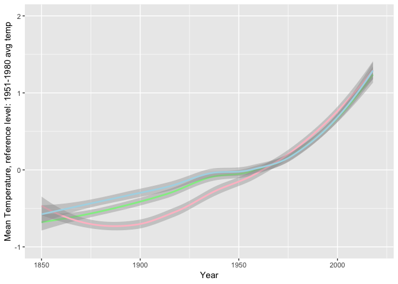 - Temperatures (Average, Min and Max) have an upward trend as emissions too.

#### NOTE:

-   IPCC reported that average temperature will reach +1.5C level between 2032 and 2050.
-   This future will be reached if temperature keeps growing linearly.

##### Long Term Trend in Uncertainties of measurements

``` r
unctemp <- ggplot(TAVGSum, aes(x=Year,y=Unc)) + geom_point(color="blue") + geom_smooth(color="orange") + ylab("Uncertainty of Average Temperature Measurement")
unctemp
```

    ## `geom_smooth()` using method = 'loess' and formula 'y ~ x'

    ## Warning: Removed 2 rows containing non-finite values (stat_smooth).

    ## Warning: Removed 2 rows containing missing values (geom_point).

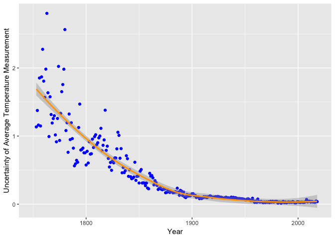 - Uncertainties have a downward trend -&gt; data should be more reliable closer to present.

#### What next?

-   More data cleaning and organizing
-   Adding a new column "TempAvg" (average temperature) to "gasemi" from 1960 to newest observation

``` r
tempAvg <- TAVGSum$Mean[TAVGSum$Year>=1960]
```

##### "gasemi" starts with year 2018 and tempAvg with 1960. Reverse tempAvg data with rev().

``` r
tempAvg18to60 <- rev(tempAvg)
gasemi$TempAvg <- tempAvg18to60
head(gasemi)
```

    ##   Year      co2 meth nitoxi Total other TempAvg
    ## 1 2018       NA   NA     NA    NA    NA   1.136
    ## 2 2017       NA   NA     NA    NA    NA   1.278
    ## 3 2016       NA   NA     NA    NA    NA   1.398
    ## 4 2015       NA   NA     NA    NA    NA   1.199
    ## 5 2014 36138285   NA     NA    NA    NA   0.941
    ## 6 2013 35837591   NA     NA    NA    NA   0.992

##### Next I'll do the same sequence of actions and add a new column "ppm" to "gasemi"

``` r
presentYear <- gasemi$Year[1] #to make sure columns length are same. 
co2from1960 <- co2Nasa[(co2Nasa$Year>=1960 & co2Nasa$Year<=presentYear),] #1960-2018
co2from1960 <- aggregate(co2from1960[,2],list(co2from1960$Year), mean) #calculate means by year
colnames(co2from1960) <- c("Year","ppm") #rename columns

ppm <- rev(co2from1960$ppm)
gasemi$ppm <- ppm #add a new column ppm

head(gasemi)
```

    ##   Year      co2 meth nitoxi Total other TempAvg      ppm
    ## 1 2018       NA   NA     NA    NA    NA   1.136 408.5217
    ## 2 2017       NA   NA     NA    NA    NA   1.278 406.5533
    ## 3 2016       NA   NA     NA    NA    NA   1.398 404.2392
    ## 4 2015       NA   NA     NA    NA    NA   1.199 400.8342
    ## 5 2014 36138285   NA     NA    NA    NA   0.941 398.6475
    ## 6 2013 35837591   NA     NA    NA    NA   0.992 396.5208

-   ppm added succesfully. There are missing values.

##### Create another data frame without missing values

``` r
gasemiNoNA <- na.omit(gasemi) #rows without missing values
head(gasemiNoNA)
```

    ##    Year      co2    meth  nitoxi    Total   other TempAvg      ppm
    ## 7  2012 35470891 8014067 3153742 53526303 6887603   0.886 393.8533
    ## 8  2011 34847501 7927061 3123551 52790527 6892414   0.904 391.6517
    ## 9  2010 33472376 7815790 3084900 50911114 6538048   1.075 389.8992
    ## 10 2009 31891899 7774920 3068678 48150621 5415125   0.899 387.4300
    ## 11 2008 32181592 7643170 3031989 48664441 5807690   0.817 385.6042
    ## 12 2007 31180501 7697440 3260053 49977387 7839393   1.116 383.7917

-   Missing values deleted
-   Deleted data may cause prediction error in modelling

Looking at the Data and Building Models
=======================================

-   Find insights from the data.
-   For modelling I will mainly use linear models with different flexibilities to point out long term trends and predictions.

##### pairs() function gives a great overview of the data and feature correlations.

``` r
pairs(gasemiNoNA)
```

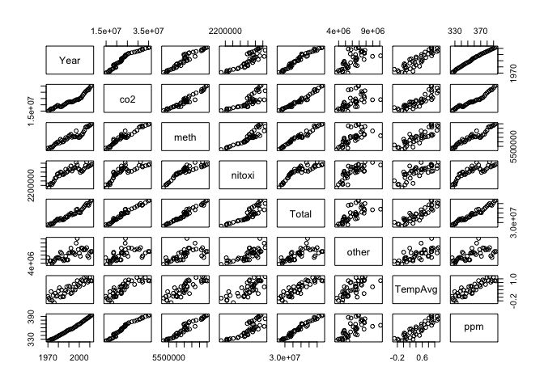 - There are strong linear correlations within the features. Of course correlation doesn't mean causality.

##### Numerical representation gives also a good sence of correlations between the features.

``` r
cor(gasemiNoNA)
```

    ##              Year       co2      meth    nitoxi     Total     other
    ## Year    1.0000000 0.9630083 0.9547119 0.8684428 0.9773814 0.6713778
    ## co2     0.9630083 1.0000000 0.9652673 0.7954593 0.9822643 0.5584203
    ## meth    0.9547119 0.9652673 1.0000000 0.8985313 0.9812468 0.6512932
    ## nitoxi  0.8684428 0.7954593 0.8985313 1.0000000 0.8696805 0.7687089
    ## Total   0.9773814 0.9822643 0.9812468 0.8696805 1.0000000 0.7006633
    ## other   0.6713778 0.5584203 0.6512932 0.7687089 0.7006633 1.0000000
    ## TempAvg 0.8886525 0.8619863 0.8423135 0.7608997 0.8860142 0.6715350
    ## ppm     0.9970263 0.9780776 0.9594606 0.8453090 0.9837267 0.6471924
    ##           TempAvg       ppm
    ## Year    0.8886525 0.9970263
    ## co2     0.8619863 0.9780776
    ## meth    0.8423135 0.9594606
    ## nitoxi  0.7608997 0.8453090
    ## Total   0.8860142 0.9837267
    ## other   0.6715350 0.6471924
    ## TempAvg 1.0000000 0.8936482
    ## ppm     0.8936482 1.0000000

-   All the gasses are highly correlated with TempAvg - Average Temperature.
-   Average correlation between gasses and Average Temperature is more than 80%

#### I have shown that there is an upward trend in both temperature and gas emissions. There's also strong correlations between those features. Co2 also forms the majority of emissions (66% - at year 2010)

-   Next I will do modelling and find out what kind of models performs best in fitting the data and performing predictions.

Modelling
=========

-   I will use model selection methods to see which gasses are the best predictors for Temperature.
-   Approaches: Best Subset Selection, Forward and Backward stepwise selection
-   Why: There are just few features so these selection methods will work ok, especially Best subset selection.

### Best Subset Selection

``` r
#install.packages("leaps")
library(leaps)
regfit.TempAvg <- regsubsets(TempAvg~co2+meth+nitoxi+other,data=gasemiNoNA)
summary(regfit.TempAvg)
```

    ## Subset selection object
    ## Call: regsubsets.formula(TempAvg ~ co2 + meth + nitoxi + other, data = gasemiNoNA)
    ## 4 Variables  (and intercept)
    ##        Forced in Forced out
    ## co2        FALSE      FALSE
    ## meth       FALSE      FALSE
    ## nitoxi     FALSE      FALSE
    ## other      FALSE      FALSE
    ## 1 subsets of each size up to 4
    ## Selection Algorithm: exhaustive
    ##          co2 meth nitoxi other
    ## 1  ( 1 ) "*" " "  " "    " "  
    ## 2  ( 1 ) "*" " "  " "    "*"  
    ## 3  ( 1 ) "*" "*"  " "    "*"  
    ## 4  ( 1 ) "*" "*"  "*"    "*"

#### CO2 is the most significant single gas to predict Average Temperature based on Best Subset selection

### Forward Stepwise Selection

``` r
regfit.TempAvg <- regsubsets(TempAvg~co2+meth+nitoxi+other,data=gasemiNoNA,method = "forward")
summary(regfit.TempAvg)
```

    ## Subset selection object
    ## Call: regsubsets.formula(TempAvg ~ co2 + meth + nitoxi + other, data = gasemiNoNA, 
    ##     method = "forward")
    ## 4 Variables  (and intercept)
    ##        Forced in Forced out
    ## co2        FALSE      FALSE
    ## meth       FALSE      FALSE
    ## nitoxi     FALSE      FALSE
    ## other      FALSE      FALSE
    ## 1 subsets of each size up to 4
    ## Selection Algorithm: forward
    ##          co2 meth nitoxi other
    ## 1  ( 1 ) "*" " "  " "    " "  
    ## 2  ( 1 ) "*" " "  " "    "*"  
    ## 3  ( 1 ) "*" "*"  " "    "*"  
    ## 4  ( 1 ) "*" "*"  "*"    "*"

### Backward Stepwise Selection

``` r
regfit.TempAvg <- regsubsets(TempAvg~co2+meth+nitoxi+other,data=gasemiNoNA,method="backward")
summary(regfit.TempAvg)
```

    ## Subset selection object
    ## Call: regsubsets.formula(TempAvg ~ co2 + meth + nitoxi + other, data = gasemiNoNA, 
    ##     method = "backward")
    ## 4 Variables  (and intercept)
    ##        Forced in Forced out
    ## co2        FALSE      FALSE
    ## meth       FALSE      FALSE
    ## nitoxi     FALSE      FALSE
    ## other      FALSE      FALSE
    ## 1 subsets of each size up to 4
    ## Selection Algorithm: backward
    ##          co2 meth nitoxi other
    ## 1  ( 1 ) "*" " "  " "    " "  
    ## 2  ( 1 ) "*" " "  " "    "*"  
    ## 3  ( 1 ) "*" "*"  " "    "*"  
    ## 4  ( 1 ) "*" "*"  "*"    "*"

-   All three model (Best Subset selection, Forward and Backward Stepwise Selection) give the same models for different model sizes.
-   Co2 is always chosen for model size 1.

The main task was to point out the importance of carbon dioxide correlation to temperature. Let's try linear regression next. My response variable Y is TempAvg and predictors are different gasses.

``` r
fitCarbon <- lm(TempAvg~co2, data=gasemiNoNA)
summary(fitCarbon)
```

    ## 
    ## Call:
    ## lm(formula = TempAvg ~ co2, data = gasemiNoNA)
    ## 
    ## Residuals:
    ##      Min       1Q   Median       3Q      Max 
    ## -0.43677 -0.16709 -0.00124  0.18372  0.37896 
    ## 
    ## Coefficients:
    ##               Estimate Std. Error t value Pr(>|t|)    
    ## (Intercept) -9.172e-01  1.297e-01  -7.073 1.30e-08 ***
    ## co2          5.968e-08  5.482e-09  10.888 1.14e-13 ***
    ## ---
    ## Signif. codes:  0 '***' 0.001 '**' 0.01 '*' 0.05 '.' 0.1 ' ' 1
    ## 
    ## Residual standard error: 0.1967 on 41 degrees of freedom
    ## Multiple R-squared:  0.743,  Adjusted R-squared:  0.7368 
    ## F-statistic: 118.5 on 1 and 41 DF,  p-value: 1.14e-13

``` r
fitNitoxi <- lm(TempAvg~nitoxi,data=gasemiNoNA)
summary(fitNitoxi)
```

    ## 
    ## Call:
    ## lm(formula = TempAvg ~ nitoxi, data = gasemiNoNA)
    ## 
    ## Residuals:
    ##      Min       1Q   Median       3Q      Max 
    ## -0.53311 -0.20488  0.02944  0.15549  0.45223 
    ## 
    ## Coefficients:
    ##               Estimate Std. Error t value Pr(>|t|)    
    ## (Intercept) -2.321e+00  3.718e-01  -6.241 1.96e-07 ***
    ## nitoxi       9.918e-07  1.321e-07   7.509 3.18e-09 ***
    ## ---
    ## Signif. codes:  0 '***' 0.001 '**' 0.01 '*' 0.05 '.' 0.1 ' ' 1
    ## 
    ## Residual standard error: 0.2518 on 41 degrees of freedom
    ## Multiple R-squared:  0.579,  Adjusted R-squared:  0.5687 
    ## F-statistic: 56.38 on 1 and 41 DF,  p-value: 3.184e-09

``` r
fitMeth <- lm(TempAvg~meth, data=gasemiNoNA)
summary(fitMeth)
```

    ## 
    ## Call:
    ## lm(formula = TempAvg ~ meth, data = gasemiNoNA)
    ## 
    ## Residuals:
    ##      Min       1Q   Median       3Q      Max 
    ## -0.40501 -0.14308 -0.01223  0.14189  0.36828 
    ## 
    ## Coefficients:
    ##               Estimate Std. Error t value Pr(>|t|)    
    ## (Intercept) -2.266e+00  2.739e-01  -8.273 2.81e-10 ***
    ## meth         4.189e-07  4.186e-08  10.007 1.44e-12 ***
    ## ---
    ## Signif. codes:  0 '***' 0.001 '**' 0.01 '*' 0.05 '.' 0.1 ' ' 1
    ## 
    ## Residual standard error: 0.2092 on 41 degrees of freedom
    ## Multiple R-squared:  0.7095, Adjusted R-squared:  0.7024 
    ## F-statistic: 100.1 on 1 and 41 DF,  p-value: 1.439e-12

``` r
fitOther <- lm(TempAvg~other, data=gasemiNoNA)
summary(fitOther)
```

    ## 
    ## Call:
    ## lm(formula = TempAvg ~ other, data = gasemiNoNA)
    ## 
    ## Residuals:
    ##      Min       1Q   Median       3Q      Max 
    ## -0.56817 -0.22070 -0.01031  0.20065  0.57120 
    ## 
    ## Coefficients:
    ##               Estimate Std. Error t value Pr(>|t|)    
    ## (Intercept) -6.863e-01  2.017e-01  -3.402   0.0015 ** 
    ## other        1.873e-07  3.227e-08   5.803 8.24e-07 ***
    ## ---
    ## Signif. codes:  0 '***' 0.001 '**' 0.01 '*' 0.05 '.' 0.1 ' ' 1
    ## 
    ## Residual standard error: 0.2876 on 41 degrees of freedom
    ## Multiple R-squared:  0.451,  Adjusted R-squared:  0.4376 
    ## F-statistic: 33.68 on 1 and 41 DF,  p-value: 8.244e-07

#### p-values

Carbon: 1.14e-13

Nitrous Dioxide: 3.18e-09

Methane: 1.44e-12

Other gasses: 8.24e-07

#### R Squared:

Carbon: 74%

Nitrous Dioxide: 58%

Methane: 71%

Other gasses: 45%

### Interpretation

-   All the gasses has a low p-value.
-   Features are statistically significant in order to predict the Average Temperature.
-   Their coefficients are positive which means that there are positive correlation between response and predictor.
-   Nevertheless Carbon Dioxide has the lowest p-value and highest R-Squared = proportion of variance explained.

##### An interesting result is that Best Model Selection (model size = 2) selects "Other" with Co2 instead of "Methane" which is the second best single gas predictor. There's certainly some interaction between the data features.

### Visual Representations of Models with a regression line

###### A positive correlation can be seen visually as well.

``` r
par(mfrow=c(2,2))
plot(TempAvg~co2,gasemiNoNA, xlab="Carbon Dioxide")
abline(fitCarbon,col=2)
plot(TempAvg~meth,gasemiNoNA, xlab="Methane")
abline(fitMeth,col=3)
plot(TempAvg~nitoxi,gasemiNoNA, xlab="Nitrous Dioxide")
abline(fitNitoxi,col=4)
plot(TempAvg~other,gasemiNoNA, xlab="Other gasses")
abline(fitOther,col=6)
```

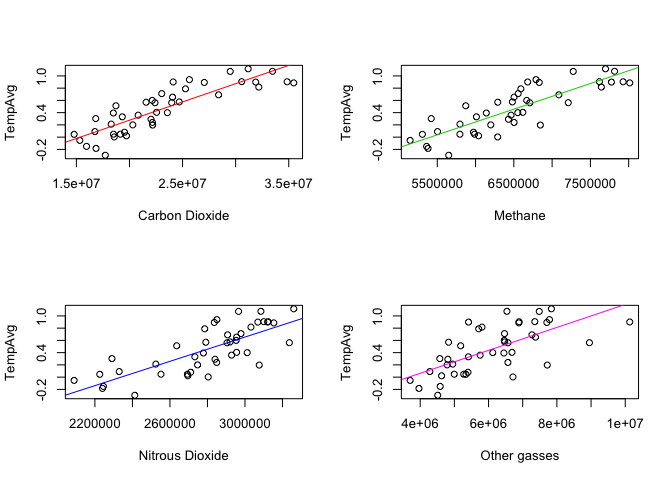

#### Adding non-linearity to the models

-   Next I will add flexibility to the models by adding higher degrees into the prediction formula.

###### The formula will be Y=B0 + B1 \* X + B2 \* X^2 +...+ Bn \* X^n, where B is coefficient, X is a predictor and n is a degree.

##### TempAvg~Co2 with degrees 1 to 10 and corresponding RSE (Residual Standard Error).

``` r
errors <- c()
for(i in 1:10) {
  fitPoly <- lm(TempAvg~poly(co2,i), data=gasemiNoNA)
  errors[i] = summary(fitPoly)[6] #set RSE
}

plot(1:10,errors, xlab="Flexibility",ylab="RSE",type="b")
```

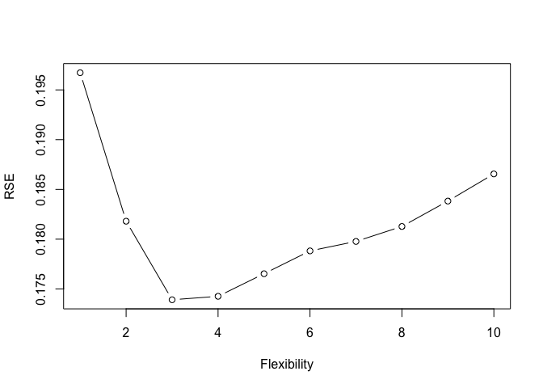

``` r
minError <- which.min(errors)
minError
```

    ## [1] 3

-   Model with a degree 3 has the lowest RSE.

#### Regression lines visually (from 1 to 6 degrees)

``` r
par(mfrow=c(2,3))
for(i in 1:6) {
  plot(TempAvg~co2,gasemiNoNA)
  fitPoly <- lm(TempAvg~poly(co2,i), data=gasemiNoNA)
  lines(gasemiNoNA$co2,fitted(fitPoly),col=i+1,type="b")
}
```

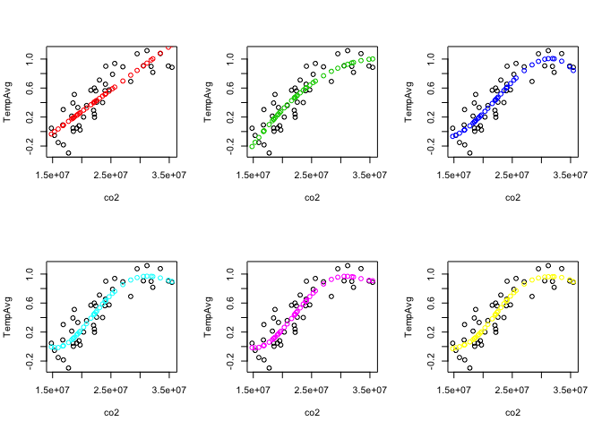 - The higher the degree is the more it's fitting. Maybe even overfitting..

Let's see what happens to a proportion of variance explained.

##### I'm using Adjusted R squared since it makes different model sizes more comparable.

``` r
adjR2 <- c()
for(i in 1:10) {
  fitPoly <- lm(TempAvg~poly(co2,i), data=gasemiNoNA)
  adjR2[i] <- summary(fitPoly)$adj.r.squared
}
adjR2
```

    ##  [1] 0.7367525 0.7751731 0.7942760 0.7934527 0.7880389 0.7824944 0.7801721
    ##  [8] 0.7764789 0.7701381 0.7632662

``` r
plot(1:10,adjR2,xlab="Number of Degrees",ylab="Adjusted R Squared", type="b")
```

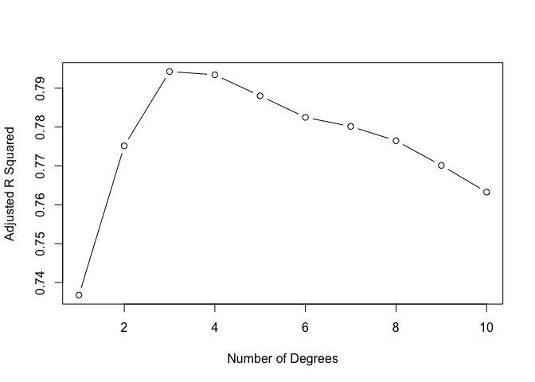 - Model with degree 3 has a highest Adjusted R Squared and the lowest RSE.

``` r
errorsMeth <- c()
for(i in 1:10) {
  fitPoly <- lm(TempAvg~poly(meth,i), data=gasemiNoNA)
  errorsMeth[i] = summary(fitPoly)[6] #set RSE
}

plot(1:10,errorsMeth, xlab="Flexibility",ylab="RSE",type="b")
```

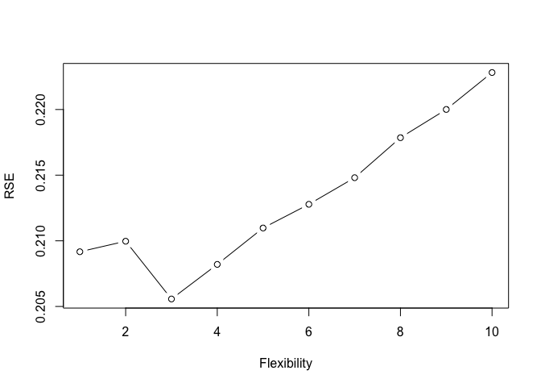

``` r
errorsNitoxi <- c()
for(i in 1:10) {
  fitPoly <- lm(TempAvg~poly(nitoxi,i), data=gasemiNoNA)
  errorsNitoxi[i] = summary(fitPoly)[6] #set RSE
}

plot(1:10,errorsNitoxi, xlab="Flexibility",ylab="RSE",type="b")
```

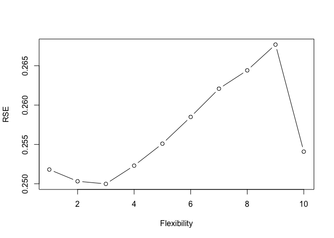 - Methane and Nitrous Dioxide has the lowest RSE when model degree is 3. This gives a little bit of idea what could be a good model to make predictions.

``` r
adjR2Meth <- c()
for(i in 1:10) {
  fitPoly <- lm(TempAvg~poly(meth,i), data=gasemiNoNA)
  adjR2Meth[i] <- summary(fitPoly)$adj.r.squared
}
adjR2Meth
```

    ##  [1] 0.7024064 0.7001218 0.7125594 0.7051420 0.6972402 0.6920377 0.6861456
    ##  [8] 0.6771760 0.6707692 0.6623001

``` r
plot(1:10,adjR2Meth,xlab="Number of Degrees",ylab="Adjusted R Squared", type="b")
```

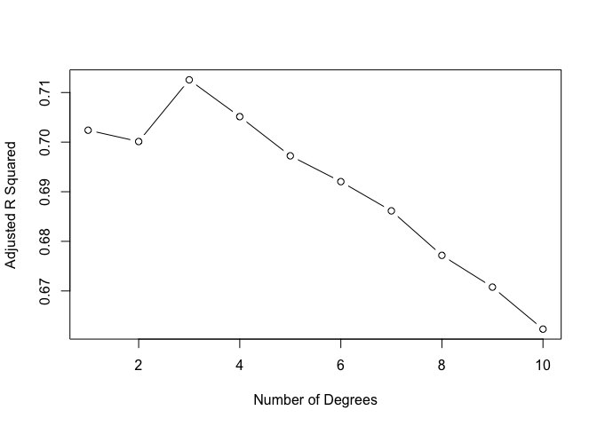

``` r
adjR2Nitoxi <- c()
for(i in 1:10) {
  fitPoly <- lm(TempAvg~poly(nitoxi,i), data=gasemiNoNA)
  adjR2Nitoxi[i] <- summary(fitPoly)$adj.r.squared
}
adjR2
```

    ##  [1] 0.7367525 0.7751731 0.7942760 0.7934527 0.7880389 0.7824944 0.7801721
    ##  [8] 0.7764789 0.7701381 0.7632662

``` r
plot(1:10,adjR2Nitoxi,xlab="Number of Degrees",ylab="Adjusted R Squared", type="b")
```

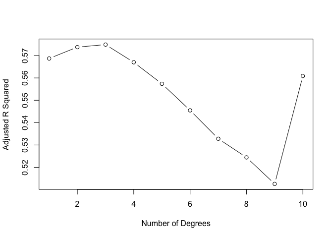

##### Adjusted R squared with all the gasses in the model.

``` r
adjR2FULL <- c()
for(i in 1:10) {
  fitPoly <- lm(TempAvg~poly(co2+meth+nitoxi+other,i), data=gasemiNoNA)
  adjR2FULL[i] <- summary(fitPoly)$adj.r.squared
}
adjR2
```

    ##  [1] 0.7367525 0.7751731 0.7942760 0.7934527 0.7880389 0.7824944 0.7801721
    ##  [8] 0.7764789 0.7701381 0.7632662

``` r
plot(1:10,adjR2FULL,xlab="Number of Degrees",ylab="Adjusted R Squared", type="b")
```

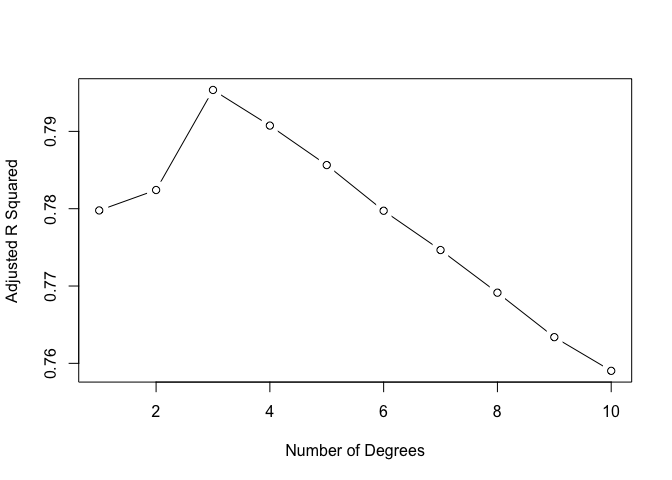

##### RSE with all the gasses in the model.

``` r
errorsFULL <- c()
for(i in 1:10) {
  fitPoly <- lm(TempAvg~poly(co2+meth+nitoxi+other,i), data=gasemiNoNA)
  errorsFULL[i] = summary(fitPoly)[6] #set RSE
}

plot(1:10,errorsFULL, xlab="Flexibility",ylab="RSE",type="b")
```

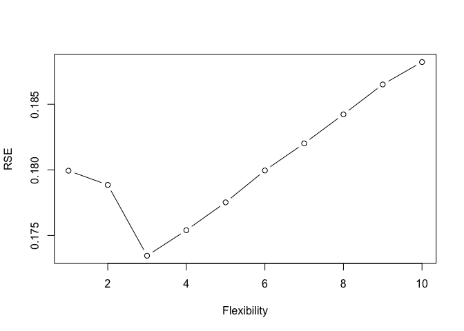

#### NOTES:

-   All gasses separately and together have the highest Adjusted R squared when degree of the model is 3
-   All gasses separately and together have the lowest RSE when degree of the model is 3.
-   Based on test data the models seem to work best when the model degree is 3.
-   For predictions model with degree 3 might be the best choise.
-   Important: Model 3 might be overfitting!!

Validating the data
-------------------

-   Since the data set is so small I won't use cross validation or k-fold approaches.
-   Intead I will use Validation set approach: Split the data set in two halves (randomly): train and test data, and test what kind of RSEs models with different degrees produces.

``` r
set.seed(1)
train <- sample(seq(43),20,replace = FALSE) #train data is 20 samples
cat("Training data index(randomly chosen): ",train)
```

    ## Training data index(randomly chosen):  12 16 24 37 8 35 38 41 23 3 7 6 22 43 40 14 20 26 10 19

``` r
regfit.full <- regsubsets(TempAvg~co2+meth+nitoxi+other,data=gasemiNoNA[train,])
summary(regfit.full)
```

    ## Subset selection object
    ## Call: regsubsets.formula(TempAvg ~ co2 + meth + nitoxi + other, data = gasemiNoNA[train, 
    ##     ])
    ## 4 Variables  (and intercept)
    ##        Forced in Forced out
    ## co2        FALSE      FALSE
    ## meth       FALSE      FALSE
    ## nitoxi     FALSE      FALSE
    ## other      FALSE      FALSE
    ## 1 subsets of each size up to 4
    ## Selection Algorithm: exhaustive
    ##          co2 meth nitoxi other
    ## 1  ( 1 ) "*" " "  " "    " "  
    ## 2  ( 1 ) "*" " "  " "    "*"  
    ## 3  ( 1 ) "*" "*"  " "    "*"  
    ## 4  ( 1 ) "*" "*"  "*"    "*"

-   Similar models selected again.

#### Model degree = 1

``` r
val.errors=rep(NA,4) #validating errors
val.errors
```

    ## [1] NA NA NA NA

``` r
x.test <- model.matrix(TempAvg~co2+meth+nitoxi+other,data=gasemiNoNA[-train,])
#predictions on each model
for(i in 1:4) {
  coefi <- coef(regfit.full, id=i) #get coefficients of the model size = i
  pred <- x.test[,names(coefi)]%*%coefi #predictions
  val.errors[i] <- mean((gasemiNoNA$TempAvg[-train]-pred)^2) #save the error
}

plot(sqrt(val.errors),ylab="Root MSE", ylim=c(0,1),pch=19,type="b")
points(sqrt(regfit.full$rss[-1]/20),col="blue",pch=19,type="b")
legend("topright",legend=c("Training","Validation"),col=c("blue","black"),pch=19)
```

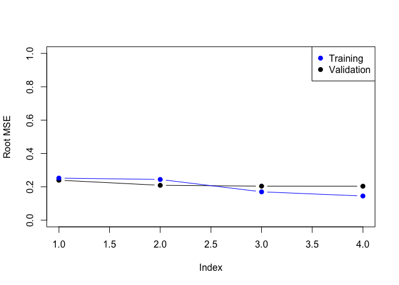

### Notes:

-   Training and Test data error seem to follow each other quite well.
-   This might be a sign that degree 3 is overfitting and actually a simpler model performs better!
-   Note to self: The data set is small -&gt; hard to make strong predictions

##### Model Degree = 3

``` r
set.seed(2)
train <- sample(seq(43),20,replace = FALSE)
train
```

    ##  [1]  8 30 24  7 37 36  5 31 17 19 34 43 41  6 12 38 27 42 29  2

``` r
regfit.full <- regsubsets(TempAvg~poly((co2+meth+nitoxi+other),3),data=gasemiNoNA[train,])
summary(regfit.full)
```

    ## Subset selection object
    ## Call: regsubsets.formula(TempAvg ~ poly((co2 + meth + nitoxi + other), 
    ##     3), data = gasemiNoNA[train, ])
    ## 3 Variables  (and intercept)
    ##                                         Forced in Forced out
    ## poly((co2 + meth + nitoxi + other), 3)1     FALSE      FALSE
    ## poly((co2 + meth + nitoxi + other), 3)2     FALSE      FALSE
    ## poly((co2 + meth + nitoxi + other), 3)3     FALSE      FALSE
    ## 1 subsets of each size up to 3
    ## Selection Algorithm: exhaustive
    ##          poly((co2 + meth + nitoxi + other), 3)1
    ## 1  ( 1 ) "*"                                    
    ## 2  ( 1 ) "*"                                    
    ## 3  ( 1 ) "*"                                    
    ##          poly((co2 + meth + nitoxi + other), 3)2
    ## 1  ( 1 ) " "                                    
    ## 2  ( 1 ) " "                                    
    ## 3  ( 1 ) "*"                                    
    ##          poly((co2 + meth + nitoxi + other), 3)3
    ## 1  ( 1 ) " "                                    
    ## 2  ( 1 ) "*"                                    
    ## 3  ( 1 ) "*"

``` r
val.errors=rep(NA,3)
val.errors
```

    ## [1] NA NA NA

``` r
x.test <- model.matrix(TempAvg~poly((co2+meth+nitoxi+other),3),data=gasemiNoNA[-train,])
#predictions on each model
for(i in 1:3) {
  coefi <- coef(regfit.full, id=i) #get coefficients of the model size = i
  pred <- x.test[,names(coefi)]%*%coefi #predictions
  val.errors[i] <- mean((gasemiNoNA$TempAvg[-train]-pred)^2) #save the error
}

plot(sqrt(val.errors),ylab="Root MSE", ylim=c(0,1),pch=19,type="b")
points(sqrt(regfit.full$rss[-1]/20),col="blue",pch=19,type="b")
legend("topright",legend=c("Training","Validation"),col=c("blue","black"),pch=19)
```

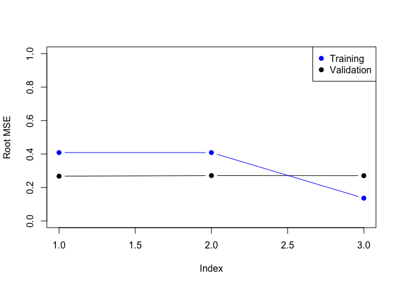

#### NOTES:

-   Prediction error with model 3 (degree=3) differs more from the model 1 (degree=1)
-   I think this is a sign that model with higher degrees are overfitting the data.
-   The data set is so small that it's hard to make strong statements.

### Predictions: CO2

-   Model degrees from 1 to 4

``` r
d <- seq(2010, 2060, length.out = 200) #predictor data for 2010-2016
par(new=T)
```

    ## Warning in par(new = T): calling par(new=TRUE) with no plot

``` r
for(degree in 1:4) {
  fm <- lm(co2 ~ poly(Year, degree), data = gasemiNoNA)
  pred <- predict(fm,newdata=data.frame(Year=d))
  plot(co2~Year,gasemiNoNA, xlim=c(1960,2060),ylim=c(1.5e+07,5.0e+07), main=as.character(degree))
  lines(gasemiNoNA$Year,fitted(fm),col=degree+1)
  lines(d, pred, col = 1, lty="dashed")
  legend("topleft", legend=c("Regression", "Prediction"), col=c((degree+1),1), lty=1:2)
}
```

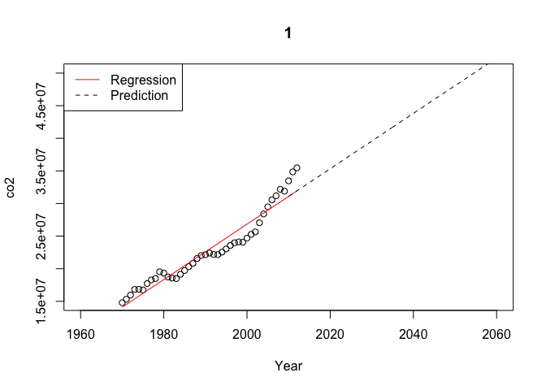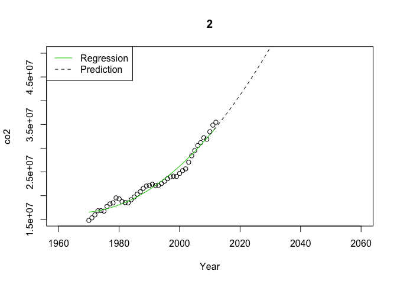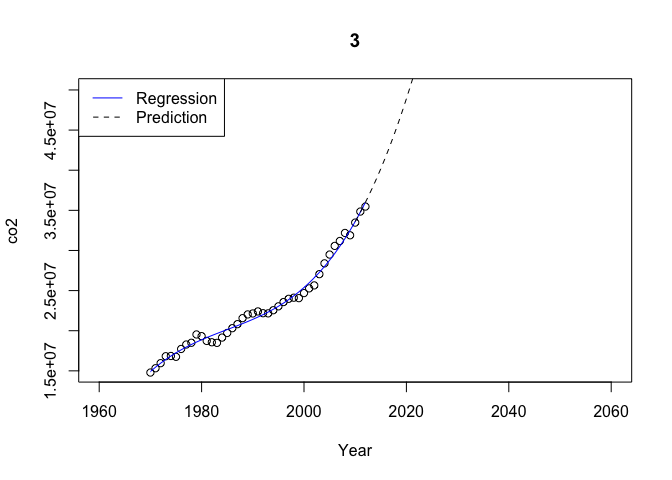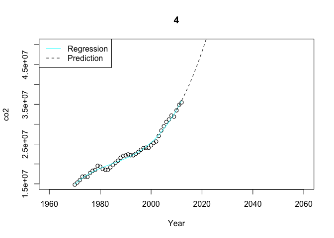

### NOTES

-   It seems that Co2 will continue growing if all other driving factors remains the same.
-   Based on RSE and AdjR2 with degree 3 performed the best but based on validation approach model with degree 1 performed better.
-   Model 3 looks alarming.
-   Based on the RSE and Adjusted R2 model 3 should be fitting the data well but it might be overfitting.

### Predictions: Average Temperature

``` r
d <- seq(2010, 2060, length.out = 200)
par(new=T)
```

    ## Warning in par(new = T): calling par(new=TRUE) with no plot

``` r
for(degree in 1:4) {
  fm <- lm(TempAvg ~ poly(Year, degree), data = gasemiNoNA)
  pred <- predict(fm,newdata=data.frame(Year=d))
  plot(TempAvg~Year,gasemiNoNA, xlim=c(1960,2060),ylim=c(-0.2,2), main= as.character(degree))
  abline(h=1.5,lty=3,col="red")
  ?abline
  ?plot
  lines(gasemiNoNA$Year,fitted(fm),col=degree+1)
  lines(d, pred, col = 1,lty="dashed")
  legend("topleft", legend=c("Regression", "Prediction","1.5 level"), col=c((degree+1),1,"red"), lty=1:3)
}
```

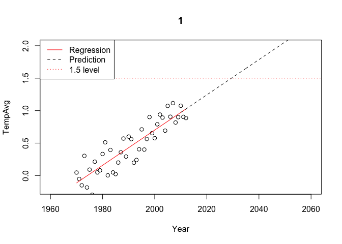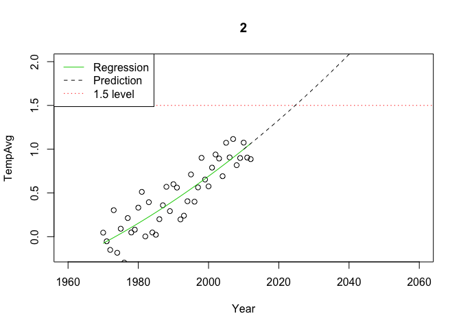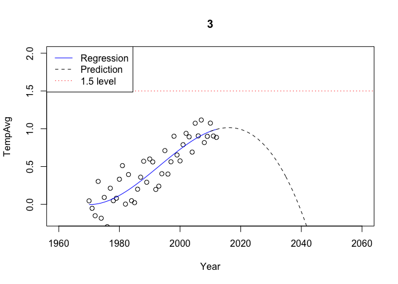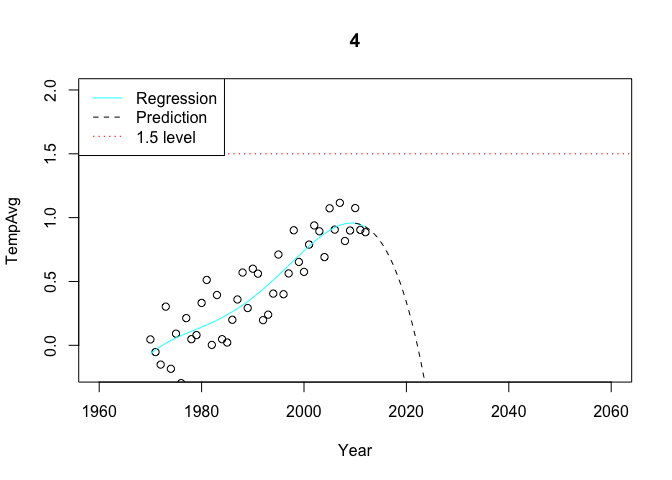

### Notes:

-   Models gives really different predictions.
-   Model with degree 1 performed best in validation. Model 1 suggests linear growth of Average Temperatures and the 1.5 C level will be crossed by Year ~2030
-   Model with degree 3 suggests that Average Temperature will start falling closer to the 1951-1980 reference level.

#### IMPORTANT NOTE:

-   Now the model 3 has a strong conflict with the IPCC reference.
-   IPCC suggested that if current conditions continue, average temperature would cross the 1.5 Celcius level between 2032 and 2050
-   From 1.5C perspective the simple linear model with degree 1 or 2 are closer to IPCC prediction.

##### Relationship and interaction of CO2 and Average Temperature

``` r
d <- seq(3.5e+07,5.0e+07, length.out = 200)
par(mfrow=c(2,3))

for(i in 1:6) {
  plot(TempAvg~co2,gasemiNoNA, xlim=c(1.5e+07,5.0e+07), ylim=c(-0.2,2), main=as.character(i), xlab="Carbon Dioxide",ylab="Average Temperature, 1951-1980 reference")
  fitPoly <- lm(TempAvg~poly(co2,i), data=gasemiNoNA)
  lines(gasemiNoNA$co2,fitted(fitPoly),col=i+1,type="b")
  pred <- predict(fitPoly,newdata=data.frame(co2=d))
  lines(d,pred,col=1,lty="dashed")
}
```

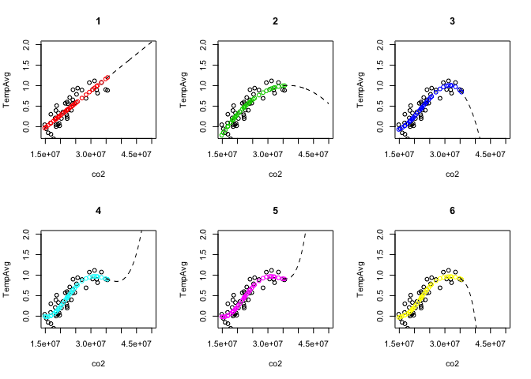

-   The model 1 seem to less radical than others. I believe it will be the most trustworthy and other models are overfitting.

Results:
--------

-   I decided to use linear models since the task was to give a picture of the long term trend in emissions, temperature.
-   It is clear that Average Temperature's and Emissions by human have increased in a long term.
-   It seems that Emissions and Temperature are positively correlated.
-   Predictions take into account historical data.
-   Different models tries to find non-linearities but the most linear ones seem to perform best.
-   Since the data used in this project has low dimensions, uncertainty of the shown predictions are high.
-   I think the models give a good picture of long time trends but future predictions are not quite accurate. If I should choose which models are the best I think that based on validation error and IPCC refereneces the simple one-degree linear regression is the best model if all the factors remains the same.

#### What the models and estimates don't take into account:

-   Models takes data but it doensn't take into account how the data is gathered. I trust to my sources.
-   Models don't include features which could be driving factors of global warming: for example aggriculture or population growth etc.
-   Data is mostly time-series data. Here I'm not looking if the data is stationary or non-stationary or if the data has any seasonal trends. Nevertheless the models gives a picture of long time trends.
-   Placements of the measurement stations.
-   Measurement stations are usually situated on rural areas. Later in the history cities have grown and environment around the stations have changed which could have caused higher or lower average temperatures at stations. These kind of things are not taken into account in modelling.

GDP vs. Total Emissions
=======================

##### Now I will create another data frame which includes GDP and Total Emissions

``` r
gdpEmi <- data.frame(
  Year = last:first,
  GDP = gdp$Value,
  TotalEmissions = total$Total
)
gdpEmiNoNa <- na.omit(gdpEmi)
```

``` r
par(mfrow=c(1,2))
plot(GDP~Year,gdpEmiNoNa, col="blue")
plot(TotalEmissions~Year,gdpEmiNoNa, col="orange")
```

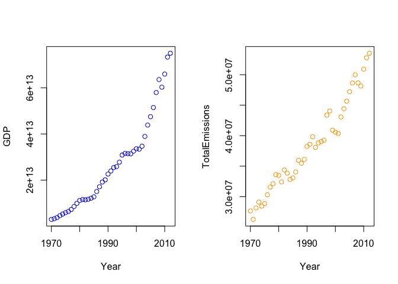

-   Both GDP and Total seem to correlate and grow linearly.

#### Relationship of GDP and Total Emissions

``` r
gdpplot <- ggplot(gdpEmiNoNa,aes(x=GDP, y=TotalEmissions)) + geom_point(color="purple")
gdpplot
```

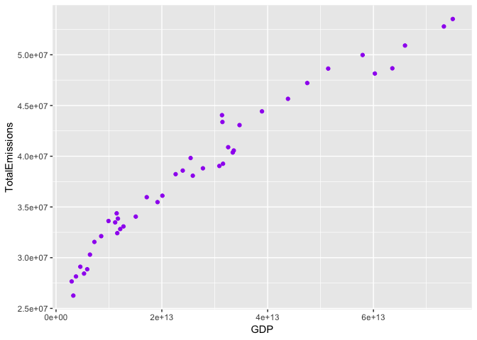

-   Total Emissions seem to grow when GDP grows.
-   Correlation: highly linear.

##### Mean GDP: 1970-91 vs. 1992-2012

``` r
par(mfrow=c(1,2))
n <- 1:(nrow(gdpEmiNoNa)/2)
gdpEmiNoNa1 <- gdpEmiNoNa
gdpEmiNoNa1$Group <- 1
gdpEmiNoNa1$Group[n] <- 2
boxgdp <- boxplot(GDP~Group, data=gdpEmiNoNa1, col="orange", names=c("1970-91","1992-2012"), main="GDP mean")

boxTotEmi <- boxplot(TotalEmissions~Group, data=gdpEmiNoNa1, col="orange", names=c("1970-91","1992-2012"), main="Total Emissions mean")
```

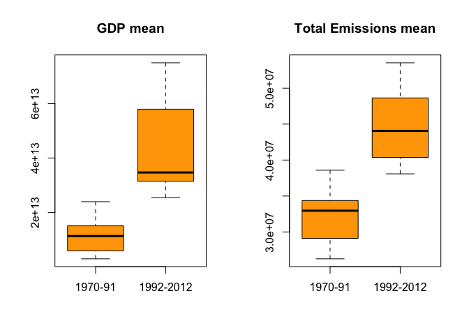

### Notes

-   The mean of GDP and Total Emissions have risen during last 40-50 years.

##### Fitting a regression line onto data.

``` r
par(mfrow=c(2,3))
for(i in 1:6) {
  plot(TotalEmissions~GDP,gdpEmiNoNa, main=as.character(i))
  fitPoly <- lm(TotalEmissions~poly(GDP,i), data=gdpEmiNoNa)
  lines(gdpEmiNoNa$GDP,fitted(fitPoly),col=i+1,type="b")
}
```

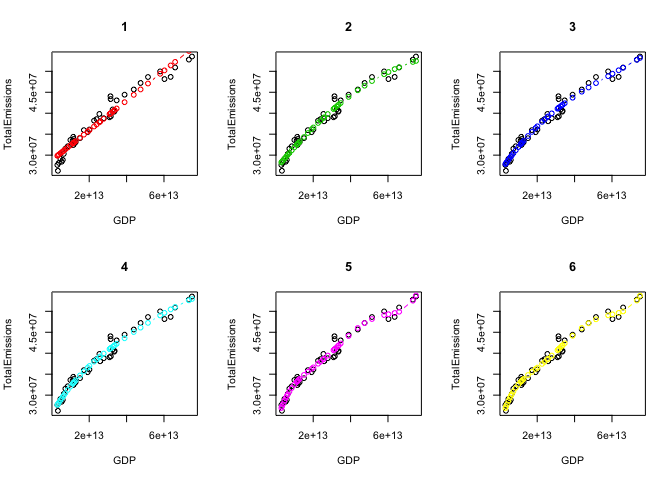 - There's not much data so strong statements cannot be made. - All the models seem to have a similar fitted curve. - It looks like the model starts to overfit too when the model degree is &gt;=4 - Model with degree 1 seem to be a bit too linear. - Based on the visualizations the model with degree 2 or 3 seem to be the best.

### RSE and Adjusted R squared of Total Emissions ~ GDP

``` r
adjR2GDP <- c()
for(i in 1:10) {
  fitPoly <- lm(TotalEmissions~poly(GDP,i), data=gdpEmiNoNa)
  adjR2GDP[i] <- summary(fitPoly)$adj.r.squared
}
adjR2
```

    ##  [1] 0.7367525 0.7751731 0.7942760 0.7934527 0.7880389 0.7824944 0.7801721
    ##  [8] 0.7764789 0.7701381 0.7632662

``` r
plot(1:10,adjR2GDP,xlab="Number of Degrees",ylab="Adjusted R Squared", type="b")
```

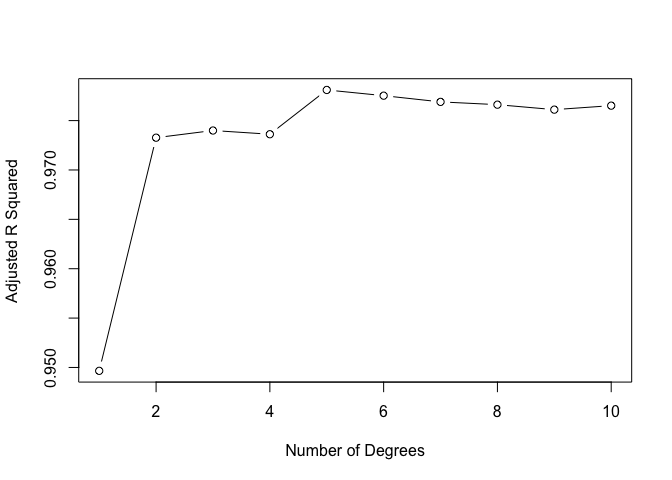

``` r
errorsGDP <- c()
for(i in 1:10) {
  fitPoly <- lm(TotalEmissions~poly(GDP,i), data=gdpEmiNoNa)
  errorsGDP[i] = summary(fitPoly)[6] #set RSE
}

plot(1:10,errorsGDP, xlab="Flexibility",ylab="RSE",type="b")
```

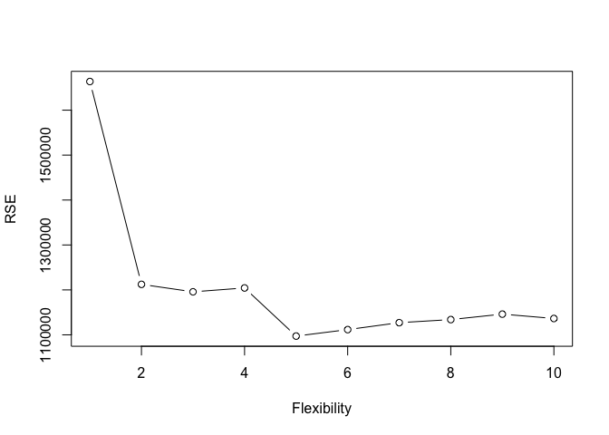 - Model with a degree 5 seem to have a highest Adjusted R squared but it might be overfitting as well as the gas models with degree 3.

#### Predictions: Total Emissions~GDP

``` r
d <- seq(6.0e+13,10e+13, length.out = 200)
par(new=T)
```

    ## Warning in par(new = T): calling par(new=TRUE) with no plot

``` r
for(i in 1:6) {
  plot(TotalEmissions~GDP,gdpEmiNoNa, xlim=c(0,10e+13), ylim=c(2.5e+07,10e+07), main=as.character(i))
  fitPoly <- lm(TotalEmissions~poly(GDP,i), data=gdpEmiNoNa)
  lines(gdpEmiNoNa$GDP,fitted(fitPoly),col=i+1,type="b")
  pred <- predict(fitPoly,newdata=data.frame(GDP=d),confint=0.95)
  lines(d,pred,col=1,lty="dashed")
}
```

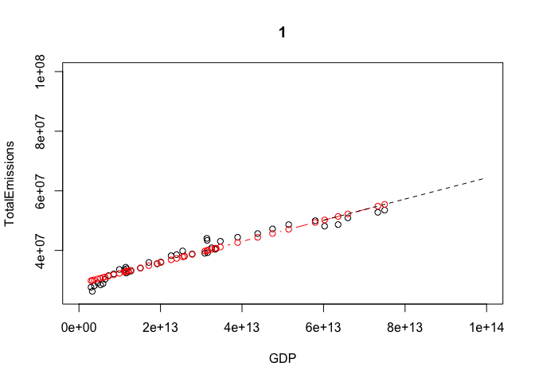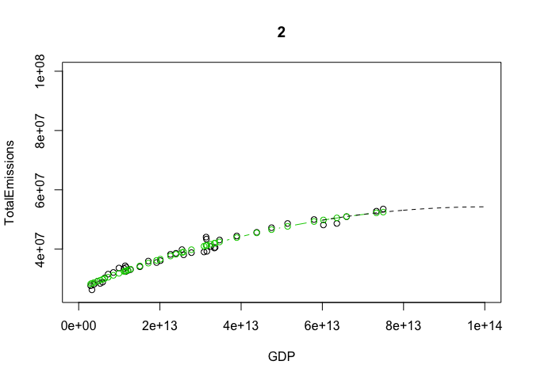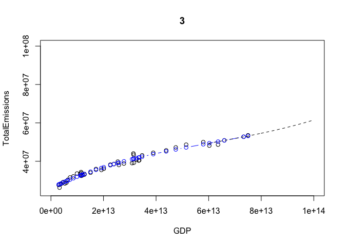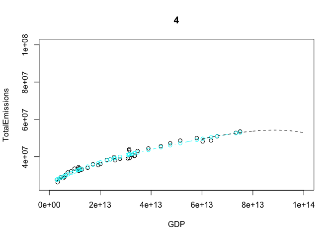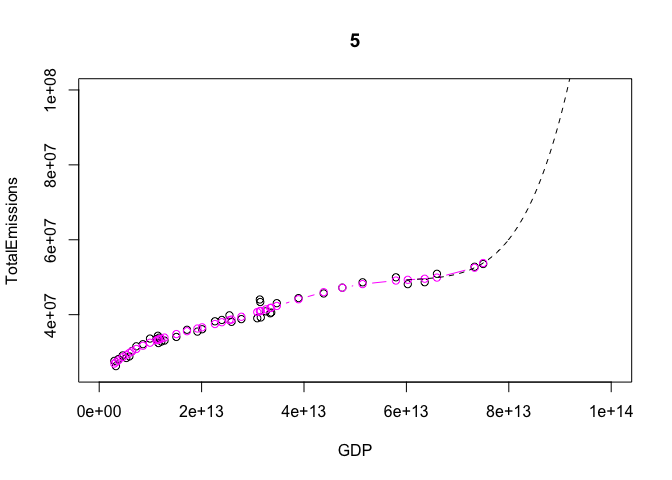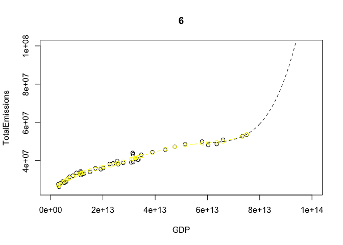

### Notes:

-   Model with a degree 5 seem to produce the smallest RSE and the highest Adjusted R squared, we should take a closer look to the model 5.
-   Model 5 seem to be overfitting the data because the curve is not following trend at all.
-   I think the best model is based on model's with degrees 1 to 3 since predictions are not behaving so radically.
-   Confidence interval is higher for smaller models.

##### P values and Adjusted R squared

``` r
for(i in 1:5) {
  fitPoly <- lm(TotalEmissions~poly(GDP,i), data=gdpEmiNoNa)
  print(summary(fitPoly))
}
```

    ## 
    ## Call:
    ## lm(formula = TotalEmissions ~ poly(GDP, i), data = gdpEmiNoNa)
    ## 
    ## Residuals:
    ##      Min       1Q   Median       3Q      Max 
    ## -3696880 -1049892    92249  1274265  4096404 
    ## 
    ## Coefficients:
    ##              Estimate Std. Error t value Pr(>|t|)    
    ## (Intercept)  38413883     253718  151.40   <2e-16 ***
    ## poly(GDP, i) 46859455    1663740   28.16   <2e-16 ***
    ## ---
    ## Signif. codes:  0 '***' 0.001 '**' 0.01 '*' 0.05 '.' 0.1 ' ' 1
    ## 
    ## Residual standard error: 1664000 on 41 degrees of freedom
    ## Multiple R-squared:  0.9509, Adjusted R-squared:  0.9497 
    ## F-statistic: 793.3 on 1 and 41 DF,  p-value: < 2.2e-16
    ## 
    ## 
    ## Call:
    ## lm(formula = TotalEmissions ~ poly(GDP, i), data = gdpEmiNoNa)
    ## 
    ## Residuals:
    ##      Min       1Q   Median       3Q      Max 
    ## -2176398  -846141   -29314   822976  2850280 
    ## 
    ## Coefficients:
    ##               Estimate Std. Error t value Pr(>|t|)    
    ## (Intercept)   38413883     184878 207.780  < 2e-16 ***
    ## poly(GDP, i)1 46859455    1212326  38.653  < 2e-16 ***
    ## poly(GDP, i)2 -7395940    1212326  -6.101 3.41e-07 ***
    ## ---
    ## Signif. codes:  0 '***' 0.001 '**' 0.01 '*' 0.05 '.' 0.1 ' ' 1
    ## 
    ## Residual standard error: 1212000 on 40 degrees of freedom
    ## Multiple R-squared:  0.9745, Adjusted R-squared:  0.9733 
    ## F-statistic: 765.6 on 2 and 40 DF,  p-value: < 2.2e-16
    ## 
    ## 
    ## Call:
    ## lm(formula = TotalEmissions ~ poly(GDP, i), data = gdpEmiNoNa)
    ## 
    ## Residuals:
    ##      Min       1Q   Median       3Q      Max 
    ## -2064230  -837812    68473   815429  2790396 
    ## 
    ## Coefficients:
    ##               Estimate Std. Error t value Pr(>|t|)    
    ## (Intercept)   38413883     182349 210.661  < 2e-16 ***
    ## poly(GDP, i)1 46859455    1195745  39.189  < 2e-16 ***
    ## poly(GDP, i)2 -7395940    1195745  -6.185 2.86e-07 ***
    ## poly(GDP, i)3  1739814    1195745   1.455    0.154    
    ## ---
    ## Signif. codes:  0 '***' 0.001 '**' 0.01 '*' 0.05 '.' 0.1 ' ' 1
    ## 
    ## Residual standard error: 1196000 on 39 degrees of freedom
    ## Multiple R-squared:  0.9759, Adjusted R-squared:  0.974 
    ## F-statistic: 525.4 on 3 and 39 DF,  p-value: < 2.2e-16
    ## 
    ## 
    ## Call:
    ## lm(formula = TotalEmissions ~ poly(GDP, i), data = gdpEmiNoNa)
    ## 
    ## Residuals:
    ##      Min       1Q   Median       3Q      Max 
    ## -1961043  -831578    88953   837076  2891564 
    ## 
    ## Coefficients:
    ##               Estimate Std. Error t value Pr(>|t|)    
    ## (Intercept)   38413883     183660 209.158  < 2e-16 ***
    ## poly(GDP, i)1 46859455    1204338  38.909  < 2e-16 ***
    ## poly(GDP, i)2 -7395940    1204338  -6.141 3.65e-07 ***
    ## poly(GDP, i)3  1739814    1204338   1.445    0.157    
    ## poly(GDP, i)4  -803777    1204338  -0.667    0.509    
    ## ---
    ## Signif. codes:  0 '***' 0.001 '**' 0.01 '*' 0.05 '.' 0.1 ' ' 1
    ## 
    ## Residual standard error: 1204000 on 38 degrees of freedom
    ## Multiple R-squared:  0.9761, Adjusted R-squared:  0.9736 
    ## F-statistic: 388.5 on 4 and 38 DF,  p-value: < 2.2e-16
    ## 
    ## 
    ## Call:
    ## lm(formula = TotalEmissions ~ poly(GDP, i), data = gdpEmiNoNa)
    ## 
    ## Residuals:
    ##      Min       1Q   Median       3Q      Max 
    ## -1736371  -810209    90180   658408  3132085 
    ## 
    ## Coefficients:
    ##               Estimate Std. Error t value Pr(>|t|)    
    ## (Intercept)   38413883     167328 229.573  < 2e-16 ***
    ## poly(GDP, i)1 46859455    1097242  42.707  < 2e-16 ***
    ## poly(GDP, i)2 -7395940    1097242  -6.740  6.3e-08 ***
    ## poly(GDP, i)3  1739814    1097242   1.586   0.1213    
    ## poly(GDP, i)4  -803777    1097242  -0.733   0.4685    
    ## poly(GDP, i)5  3251242    1097242   2.963   0.0053 ** 
    ## ---
    ## Signif. codes:  0 '***' 0.001 '**' 0.01 '*' 0.05 '.' 0.1 ' ' 1
    ## 
    ## Residual standard error: 1097000 on 37 degrees of freedom
    ## Multiple R-squared:  0.9807, Adjusted R-squared:  0.9781 
    ## F-statistic: 376.2 on 5 and 37 DF,  p-value: < 2.2e-16

#### p-values

-   Based on p-values GDP's and Total Emissions's relationship seem to be highly correlated

#### Results Total Emissions ~ GDP:

-   The relationship is strongly correlated.
-   It seems that GDP is predicting Total Emissions well.
-   The confidence interval for smaller models are high (95%)
-   Larger models seem to overfit.
-   Adj. R Squareds are really high &gt;90%.
-   I believe the simplest models are the most realistic and they also avoid overfitting.
-   Total Emissions will continue growing if GDP grows.
-   The models are catching the long term trend but they are quite ambiguous so the prediction accuracy is not the best possible.

API
===

Key elements:

-   Access: is the user allowed to get data through api.
-   Request: Did the Api actually asked for data.
-   Methods with parameters and response.

#### A few example methods:

-   getModel(list(predictors),response)

> returns a plot with predictors on the X-axis and response on the Y-axis

-   getPrediction(model\_id,list(predictor),response, start, end)

> return plot with a prediction on certain period

-   getData(Country, Indicator, startYear, endYear)

> for example get co2 data based on country and time period.

-   cacheList()

> returns the list of indicators, countries etc.

-   updates()

> returns the list of latest updates of data.

-   API returns data in JSON format

Backend
=======

-   Extracting data from different sources
-   Data Cleaning and organizing: creating suitable data frames, handling missing and duplicated values
-   Feature Selection
-   Evaluating prediction error -&gt; model selection
-   Modelling and predictions

FrontEnd
========

-   FrontEnd pulls the data from the backend.
-   Visualizations and analyzing insights.
-   FrontEnd gives a possibility to reframe time windows and select different models on selected data.

### Automated Data Pipeline

##### How to get models updated when new data is added?

-   REST API can download data monthly into one platform.
-   New data is stored into database.
-   Models run new data againt existing predictions and checks if prediction errors get lower.
-   If the prediction accuracy rises the new data will be used in the model
-   Trained models are saved and but sometimes need to be fully trained again depending on the model.

##### Thanks! Hope You made It Here!
